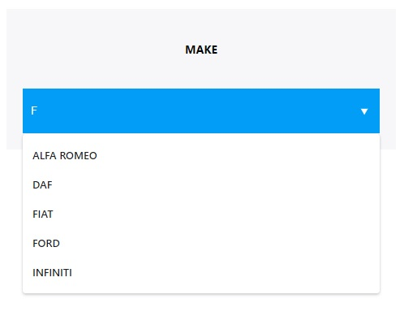
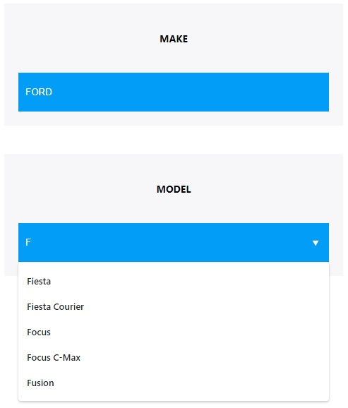
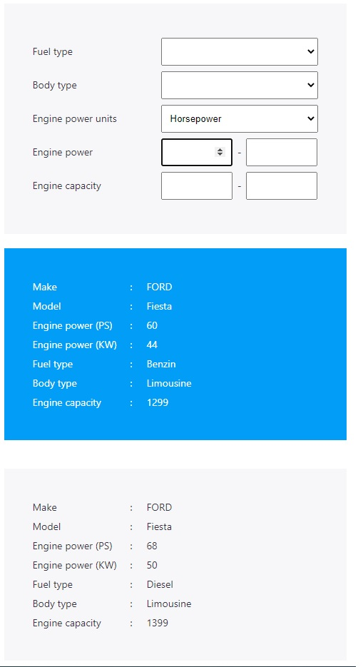

# Author - Hasan Colak

- [Github](https://github.com/hasancolak)
- [Linkedin](https://www.linkedin.com/in/hasan-colak-linkprofile/)
- [Medium](https://hasancolak.medium.com/)

# Car Selection App

This is a simple Car Selection React application.

# Installation and Settup Instructions

In the project directory, you can run:

## Installation:

`npm install`

## To start a server:

`npm start`

## To start an API server:

`node apiserver/server.js `

You can consume api like http://localhost:8080/api/makes and http://localhost:8080/api/models?make=Ford

## To visit the application:

Runs the app in the development mode.\
Open [http://localhost:3000](http://localhost:3000) to view it in the browser.

## To test the application:

`npm test`

Added the some basic unit test. Launches the test runner in the interactive watch mode.

## To build the application:

`npm run build`

Builds the app for production to the `build` folder.\
It correctly bundles React in production mode and optimizes the build for the best performance.

## Usage:

On the page, you can find a selection box to choose car make such as BMW or FORD.



After you have selected a make if there is record regarding that make servers return model list.



finally you will get a vehicle list related to the your make and model seleciton like below picture.



# Guideline

## Tech Stack

- React.js
- Typescript
- Redux and Redux Toolkit
- React Hooks
- Sass

# Consideration and Decision

## API Reference

[http://localhost:8080/api/?](http://localhost:8080/api/makes)

To get rid of CORS error, **Proxy** added for API Requests in Development.

```json
 ...
 "proxy": "http://localhost:8080/",
 ...
```

## State Management Preferences

At this project, I have used Redux with Redux-Toolkit and also React Hooks for global state management

## Design Principle and Code Quality

The separation of concerns (SoC) is one of the most fundamental principles in software development. It is so crucial that 2 out of 5 SOLID principles (Single Responsibility and Interface Segregation) are direct derivations from this concept.
